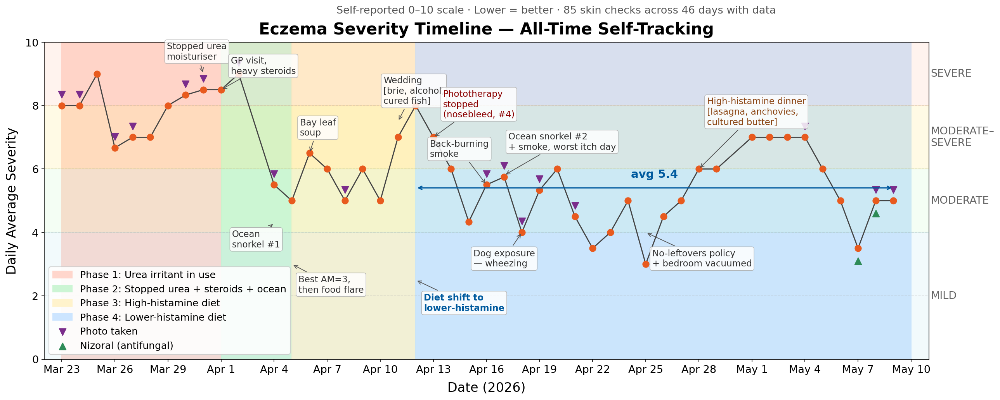
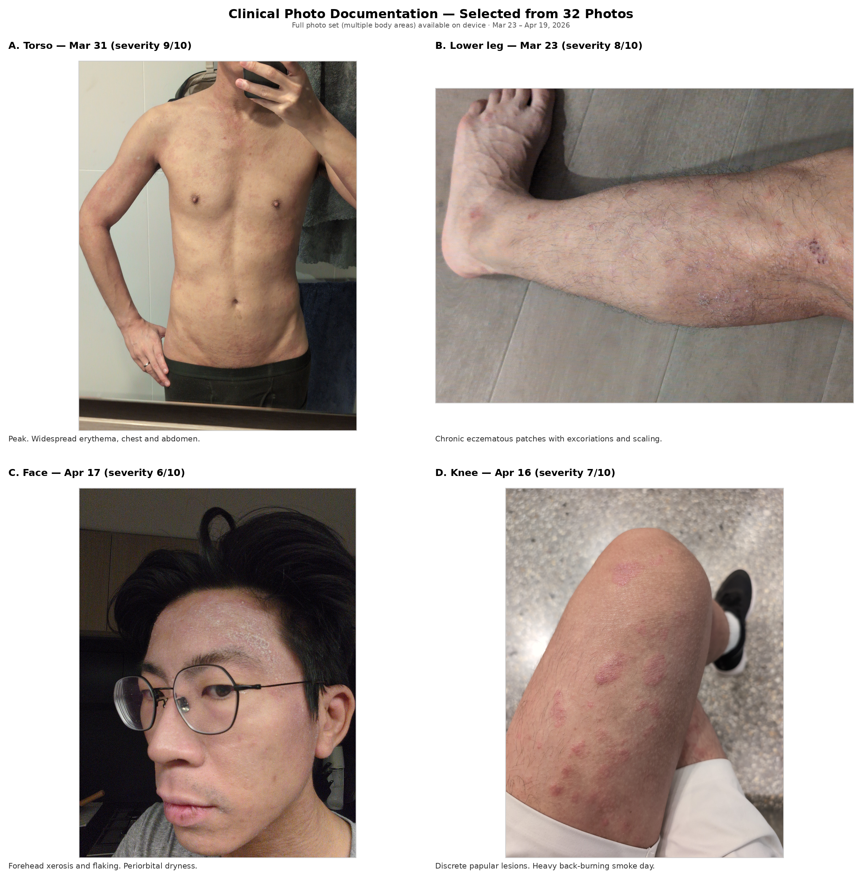

# Eczema Tracking Summary — Prepared for Dermatologist

*This report was prepared using AI. Significant editing and revision happened with Felix*

22 Apr 2026

**Patient:** Felix Kong | **Known allergies:** Peanut | **Location:** Sydney, NSW
**Tracking period:** 28 days (23 Mar – 19 Apr 2026) | App-based logging
54 skin severity checks · 217 meals · 53 medication uses · 59 contextual notes · 32 skin photos · Hourly PM2.5 air quality (5 NSW stations)

---

## Page 1: Visual Overview

### Severity Timeline

Each dot is a daily average self-reported severity (0 = clear, 10 = worst). Purple triangles mark photo dates. Background colours show phases.

**Trajectory:**
- **Weeks 1–2 (avg 8.1):** Persistent severe eczema while using CeraVe 5% urea moisturiser.
- **Early Apr:** Sharp improvement after multiple simultaneous changes (see Phase 2).
- **Weeks 3–4 (avg 5.4):** Lower severity after dietary shift. Still fluctuating 4–7.

### Clinical Photos

**Photo A** — peak severity (widespread erythema, torso). **Photo C** — typical facial involvement (forehead xerosis/flaking). **Photo D** — discrete papular lesions on knee, heavy smoke day. Full set of 32 photos available on phone.

---

## Page 2: Suspected Triggers & Allergy Testing Request

### 2a. Suspected food triggers — request for skin prick / specific IgE

| Trigger | Evidence | Observation | Interpretation |
|---------|----------|-------------|----------------|
| **Bay leaf** | 2 independent events | (1) Bay leaf stew months ago: skin worsened over the following week eating it daily. (2) Apr 6: Italian wedding soup with bay leaves at 21:05; severity 8/10 at 21:34 (prior check 14h earlier, 6/10). | Strongest single-food signal. Two independent events; published literature on bay leaf contact dermatitis [1]. |
| **Shellfish / shrimp paste** | Single event, confounded | Apr 5: Papparich lunch (~14:00) — shrimp dumplings, wat tan hor, char kuai teow. Spots by ~17:00 (sev 5), full flare by 21:00 (sev 7). Sev was 3 that morning. | Rapid onset (~3h) consistent with IgE-mediated reaction, but confounded — Frutips pastilles also eaten at 17:16, and Apr 3–4 foods (kimchi, beef curry, canned tuna) also in the pre-flare window. Cannot separate without testing. |
| **Tree nuts** | Known peanut allergy | Regularly eats cashews, almond butter, hazelnut. No isolated flare event. | Cross-reactivity panel requested given confirmed peanut allergy. |
| **Mold** | Single event, confounded | Apr 11 wedding dinner: brie, cured barramundi, margarita. Sev 8 next morning (from 7). | Could reflect mold sensitivity or histamine content of aged/fermented foods — testing could differentiate. |
| **House dust mite** | Chronic pattern | Scratches every night without exception. Skin flakes on phone/glasses every morning. Severity consistently better on waking than later in the day. | Consistent with dust mite sensitisation. |
| **Dog dander** | Single event | Apr 18: visited in-laws with a dog. Wheezy on the way home, needed Ventolin. | Clear temporal association with respiratory symptoms. |
| **Yeast extract** | Isolated event | Apr 20: fresh lentil stew made with Continental chicken stock pot (yeast extract). Itching within ~30 min. Freshly cooked — not a fridge leftover. | Fastest reaction in the dataset. Requesting yeast/yeast extract testing. If IgE is negative, would like to discuss a brief elimination trial (yeast extract, stock cubes, Vegemite). |

### 2b. Histamine and dietary pattern

**Four events:**

1. **Apr 5:** Papparich Malaysian lunch — severity rose from 3 (morning) to 7 (evening). (See shellfish row above.)
2. **Apr 6–10:** Feta, cherry tomato, cottage cheese pasta eaten daily as fridge leftovers for 5 days. Severity held 5–7.
3. **Apr 11:** Wedding dinner — brie, cured barramundi, margarita. Severity 8 next morning.
4. **Apr 20:** Fresh lentil stew with chicken stock pot (yeast extract). Itching within ~30 min. (See yeast extract row above.)

An algorithmic analysis of pre-flare meal windows across the full 28-day dataset (16 severity-spike checks; meals eaten 6–48h prior) corroborates this pattern: feta, cottage cheese, cherry tomato, beef broth, gin, dark soy sauce, shiitake mushroom, shellfish, and dried fruit appeared predominantly before severity spikes and not before good-skin checks. Notably, a fresh restaurant meal with long-cooked pork broth appeared before good-skin days — suggesting refrigeration time may be the key variable, not food type alone. Hypothesis-generating from a small dataset (28 days).

After shifting to a lower-histamine diet on Apr 12 — freshly cooked meals, freezing batches instead of fridging, avoiding aged cheese and alcohol — severity trended from 8 down to 4 over 7 days (avg 5.4 vs 6.4 prior week).

**Interpretation:** Consistent with histamine intolerance [3,4]. Cannot rule out other simultaneous changes (less alcohol, regression to the mean).

### 2c. Environmental triggers

**Back-burning smoke (PM2.5):**
- **Observed:** Apr 16 — worst itching day in the dataset. PM2.5 avg 20 µg/m³ (max 47), vs baseline 6–8. Also wheezy. Apr 14 — visible smog, itchy afternoon, sniffling.
- **Interpretation:** Temporal correlation consistent with PM2.5-associated AD exacerbation [8]. Confounded: Apr 16 was also an office day.

**Ocean swimming:**
- **Observed:** Apr 4 and Apr 17 produced the two best outcomes in the dataset. Sev 3 after first session; "nothing felt itchy, skin felt more solid" after second.
- **Interpretation:** Both were 1hr+ ocean swims. Continuing.

---

## Page 3: Treatment History & Questions

### 3a. Medications used (28 days)

| Medication | Uses | Observations |
|-----------|------|-------------|
| Eleuphrat (mometasone) | 9 | Primary steroid for body. |
| Diprosone OV (betamethasone) | 8 | Prescribed Apr 1 by GP for acute flare. |
| Sudocrem | 8 | Used in combination with steroids. |
| QV Eczema Daily Cream | 12 | Stings on rashy areas (noted Apr 14). |
| Elidel (pimecrolimus) | 3 | Used on face. |
| Telfast (fexofenadine) | 6 | Reactive use only. **Currently stopped in preparation for skin prick test.** |
| Ventolin (salbutamol) | PRN | Used Apr 18 after dog exposure. |

### 3b. What was tried and stopped

- **CeraVe 5% urea cream** (~2 months, stopped Mar 31) — severity consistently 8–9 while using it. Improvement after stopping was confounded by simultaneous heavy steroids. Urea is a documented irritant on compromised barrier [10].
- **Phototherapy / narrowband UVB** (4 sessions, Mar 30 – Apr 13) — no visible improvement in data. Nosebleed at session 4. Stopped.
- **Ocean snorkeling** (Apr 4, Apr 17) — produced the two best outcomes in the dataset: severity 3 after first session, "nothing felt itchy" after second. Continuing.

### 3c. For your awareness during examination

- **Chronic nightly scratching** every single night. Skin flakes on phone/glasses every morning.
- **Morning face redness:** face is pale on waking, reddens within minutes of being upright (noted Apr 14, 18, 19). Potentially related to hot black tea - either tea or hot liquids.
- **Respiratory symptoms:** wheezy on back-burning smoke days (Apr 14, 16) and after dog exposure (Apr 18). Needed Ventolin.

### 3d. Questions for this visit

1. **Low-histamine diet — am I doing it right?** I shifted to freshly cooked meals on Apr 12, freezing batch portions instead of eating 5-day fridge leftovers, avoiding aged cheese and alcohol. Severity has trended from 8 down to 4 over the past week. Is this improvement clinically meaningful, or could it be regression to the mean? Am I missing anything — are there items I'm still eating that I should cut?

2. **Can we do an allergy test (e.g. IgE, skin-prick)** — does that support a histamine intolerance diagnosis? What about a DAO blood test [7], or is continuing the empirical diet the better diagnostic path?

3. **Facial redness** — face is pale on waking and reddens considerably within minutes of being upright (noted Apr 14, 18, 19). Possibly related to morning hot black tea. What can I do to reduce redness?

---

## Appendix A: Photo Index

32 skin photos across 8 dates, all stored in the tracking app.

| Date | Severity | Photos | Body areas | Context |
|------|----------|--------|------------|---------|
| Mar 23 | 8 | 1 | Lower leg | Baseline — start of tracking |
| Mar 26 | 5 | 1 | Thigh/knee | Post-gym |
| Mar 30 | 8 | 7 | Face, torso, arms, back, chest | Worst period, multiple areas |
| Mar 31 | 9 | 7 | Torso, arms, back, chest | Peak severity (urea still in use) |
| Apr 2 | 9 | 9 | Torso, legs, arms | Heavy steroid application day |
| Apr 16 | 7 | 1 | Knee | Heavy back-burning day, worst itching |
| Apr 17 | 6 | 5 | Face, arms | Before/after snorkeling #2 |
| Apr 19 | 6 | 1 | Face/neck | Current |

## Appendix B: Extended Daily Log

### Phase 1 — Urea irritant in use (Mar 23 – Apr 1), avg severity 8.1

CeraVe 5% urea moisturiser in continuous use throughout this phase. Topical steroids applied regularly (Eleuphrat, Sudocrem, Elidel) but severity remained 7–9.

- **Mar 24:** Stress noted ("stressful day"). Severity 8.
- **Mar 28–29:** Poor sleep noted both nights. Severity 7–8.
- **Mar 30:** Stress noted again ("bad skin made me stressed"). Phototherapy #1. Severity 8–9.
- **Mar 31:** Stopped urea moisturiser. Severity 8.5–9.
- **Apr 1:** GP visit. Prescribed Diprosone OV. Heavy steroid application. Phototherapy #2. Severity 8.5.

### Phase 2 — Improvement (Apr 2–5), severity 9 → 3

Multiple changes occurred simultaneously and cannot be separated:
- Stopped urea moisturiser (Mar 31)
- Heavy steroid push (Apr 1–2): Diprosone OV + Eleuphrat + QV cream
- Ocean snorkeling (Apr 4): 1hr in 22°C water with wetsuit, cold outdoor shower

Severity trajectory: 9 (Apr 2) → 6 (Apr 4 AM) → 5 (Apr 4 PM) → 3 (Apr 5 AM, best reading in dataset).

### Phase 3 — Rebound + high-histamine diet (Apr 5–11), avg severity 5.8

- **Apr 5:** Papparich lunch (shrimp, Malaysian food) + Frutips blackcurrant pastilles → severity 3→7 within hours.
- **Apr 6:** Bay leaf soup (21:05), feta-tomato-cottage-cheese pasta began (eaten as fridge leftovers for next 5 days).
- **Apr 8:** Osteria Luna dinner (tomato crab pasta, negroni). Telfast reduced arm redness within ~1hr.
- **Apr 10:** Day 5 of leftover pasta. Parkrun.
- **Apr 11:** Wedding dinner — brie, cured barramundi, margarita. Severity 7→8 next morning.

### Phase 4 — Lower-histamine diet (Apr 12+), avg severity 5.4, trending toward 4

Diet shifted to freshly cooked meals (poached chicken, rice, vegetables, dumplings). Frozen batch portions instead of 5-day fridge storage.

- **Apr 13:** Phototherapy #4. Nosebleed at session. Severity 7.
- **Apr 14:** Back-burning smoke visible. Poor sleep. Itchy all afternoon. Severity 6.
- **Apr 15:** Gym. Skin stable all day. Severity 4.3 (second-best period).
- **Apr 16:** Worst itching day. Heavy back-burning (PM2.5 avg 20, max 47 µg/m³). Wheezy. Scratched heavily after getting home at 17:00 and again after shower. Severity 4→7.
- **Apr 17:** Ocean snorkeling #2. "Nothing felt itchy. Skin felt more solid." Severity 6→5.
- **Apr 18:** Walk + gym. Dog exposure → wheezy, Ventolin. Severity 4.
- **Apr 19:** Severity 4 on waking, 6 later. "My skin is definitely worse. Is it the tea? Neck is also bad."

## Appendix C: Air Quality vs Flares

Hourly PM2.5 data from 5 NSW DPIE stations (2,990 readings, 26 days). Selected dates:

| Date | Avg PM2.5 (CBD stations) | Max PM2.5 | Severity | Symptoms |
|------|--------------------------|-----------|----------|----------|
| Apr 14 | 7.1 | 11.9 | 6.0 | Visible smog, sniffling, itchy afternoon |
| Apr 15 | 11.0 | 21.8 | 4.3 | No respiratory symptoms |
| **Apr 16** | **20.0** | **47.1** | **5.5** | **Worst itch day, wheezy, heavy back-burning** |
| Apr 17 | 14.5 | 32.0 | 5.8 | Faint smoke smell; snorkeling day |
| Typical day | 6–8 | 10–15 | — | Baseline |

Note: Apr 16 had the highest PM2.5 readings AND the worst subjective itching in the dataset. This is a single co-occurrence — it may be coincidental.

## Appendix D: References

Accessed April 2026.

1. Pereira F, Santos R, Pereira A. Contact dermatitis from bay leaf. Contact Dermatitis. 2002;46(5):307-308. PMID: 33191495.
2. Werfel T, Breuer K. Role of food allergy in atopic dermatitis. Curr Opin Allergy Clin Immunol. 2004;4(5):379-385. See also: Eigenmann PA, et al. Food allergy and atopic dermatitis. Pediatr Allergy Immunol. 2020;31(Suppl 24):54-56. PMC5122280.
3. Maintz L, Benfadal S, Allam JP, et al. Evidence for a reduced histamine degradation capacity in a subgroup of patients with atopic eczema. J Allergy Clin Immunol. 2006;117(5):1106-1112. PMID: 16675339.
4. Lackner S, Malcher V, Ber J, et al. Histamine intolerance prevalence in patients with atopic dermatitis. Nutrients. 2024;16(24):4325. PMC12114600.
5. Colombo FM, Cattaneo P, Confalonieri E, et al. Histamine food poisonings: a systematic review and meta-analysis. Crit Rev Food Sci Nutr. 2018;58(7):1131-1151. PMC7305651.
6. Chung BY, Park SY, Byun YS, et al. Effect of different cooking methods on histamine levels in selected foods. Ann Dermatol. 2017;29(6):706-714. PMC5705351.
7. Mušič E, Korošec P, Šilar M, et al. Serum diamine oxidase activity as a diagnostic test for histamine intolerance. Wien Klin Wochenschr. 2013;125(9-10):239-243. PMC3354134.
8. Fadadu RP, Grimes B, Jewell NP, et al. Association of wildfire air quality and dermatology visits for atopic dermatitis. JAMA Dermatol. 2021;157(6):658-666.
9. Murota H, Yamaga K, Ono E, et al. Sweat in the pathogenesis of atopic dermatitis. Allergol Int. 2018;67(4):455-459. See also: Shiohara T, et al. Sweat as an efficient natural moisturizer. Curr Probl Dermatol. 2016;51:30-41. PMC3708933.
10. Pan M, Heinecke G, Bernardo S, et al. Urea: a comprehensive review of the clinical literature. Dermatol Online J. 2013;19(11). PMC8611129.
11. Heinlin J, Maisch T, Zimmermann T, et al. Balneophototherapy for atopic dermatitis. Photodermatol Photoimmunol Photomed. 2002;18(6):286-291. PMID: 12459524.
12. Chang YS, Chiang BL. Sleep disorders and atopic dermatitis: a 2-way street? J Allergy Clin Immunol. 2018;142(4):1033-1040. PMC9026738.
13. Silverberg JI. Selected comorbidities of atopic dermatitis: atopic march, food allergy, and sleep. Clin Dermatol. 2017;35(4):360-366. PMC5216171.
14. Cevikbas F, Lerner EA. Physiology and pathophysiology of itch. Physiol Rev. 2020;100(3):945-982. PMC10622160.
15. Heratizadeh A, Werfel T. Histamine and low-histamine diet in atopic dermatitis. In: Histamine Intolerance. Springer; 2021. PMC3199434.
16. Werfel T, Ahlers G, Schmidt P, et al. Exogenous histamine aggravates eczema in a subgroup of patients with atopic dermatitis. Acta Derm Venereol. 2009;89(1):52-56. PMID: 19197542.
17. San Miguel SM, Opperman LA, Allen EP, et al. Evidence for dietary management of histamine intolerance. Nutrients. 2023;15(24). PMC12470264.
